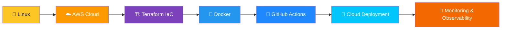

<!-- ═══════════════════════════════════════════════════════════════ -->
<!--                    ANIMATED HEADER WAVE                       -->
<!-- ═══════════════════════════════════════════════════════════════ -->

<div align="center">
  
</div>

<!-- ═══════════════════════════════════════════════════════════════ -->
<!--                    TYPING ANIMATION                           -->
<!-- ═══════════════════════════════════════════════════════════════ -->

<div align="center">
  <br/>
  
  <br/><br/>
</div>

<!-- ═══════════════════════════════════════════════════════════════ -->
<!--                    PROFILE BADGES                             -->
<!-- ═══════════════════════════════════════════════════════════════ -->

<div align="center">

  
  &nbsp;
  
  &nbsp;
  
  &nbsp;
  

</div>

<br/>

<!-- ═══════════════════════════════════════════════════════════════ -->
<!--                    QUICK NAVIGATION                           -->
<!-- ═══════════════════════════════════════════════════════════════ -->

<div align="center">

[🏠 About](#-about-me) &nbsp;•&nbsp; [🛠️ Skills](#%EF%B8%8F-tech-stack) &nbsp;•&nbsp; [☁️ Journey](#%EF%B8%8F-my-cloud-journey) &nbsp;•&nbsp; [🚀 Projects](#-featured-projects) &nbsp;•&nbsp; [📊 Stats](#-github-stats) &nbsp;•&nbsp; [🗺️ Roadmap](#%EF%B8%8F-future-learning-roadmap) &nbsp;•&nbsp; [🏅 Certs](#-certifications--learning-path) &nbsp;•&nbsp; [🌍 Connect](#-connect-with-me)

</div>

<br/>


<br/>

<!-- ═══════════════════════════════════════════════════════════════ -->
<!--                    ABOUT ME                                   -->
<!-- ═══════════════════════════════════════════════════════════════ -->

<h2 align="center">👨‍💻 About Me</h2>

<br/>

<p align="center">
  Hi! I'm <b>Vanshaj Rawat</b> — an aspiring <b>AWS Cloud Engineer</b> from Delhi NCR, India 🇮🇳<br/>
  Currently pursuing my <b>M.Tech in Computer Science Engineering</b> at Dronacharya College of Engineering.<br/>
  I'm on a mission to master cloud infrastructure, DevOps practices, and Linux systems — <i>one project at a time</i>.
</p>

<br/>

<table align="center" border="0" width="92%">
  <tr>
    <td width="55%" valign="top">

- ☁️ **AWS Cloud** enthusiast — hands-on with IAM, EC2, S3, and VPC
- 🏗️ **Building** cloud infrastructure with Terraform and GitHub Actions
- 🐳 **Containerizing** applications with Docker
- 🐧 **Linux** practitioner — command line, scripting, and system fundamentals
- 🌐 **Networking** — TCP/IP, DNS, routing, and subnetting concepts
- 🔄 **Automating** workflows and infrastructure with CI/CD pipelines
- 📚 **Continuous learner** — following AWS docs and cloud best practices
- 🤝 **Open to collaborate** on cloud and DevOps open source projects

    </td>
    <td width="45%" align="center" valign="middle">
      
    </td>
  </tr>
</table>

<br/>

<!-- ═══════════════════════════════════════════════════════════════ -->
<!--              CURRENTLY BUILDING — RECRUITER MAGNET            -->
<!-- ═══════════════════════════════════════════════════════════════ -->

<div align="center">
  <h3>🚀 Currently Building</h3>
  <br/>

  | &nbsp; | Project | Status |
  |:---:|:---|:---:|
  | ☁️ | **AWS Infrastructure Labs** — hands-on S3, EC2, VPC projects | 🔨 Active |
  | ⚙️ | **Terraform Templates** — reusable IaC modules for AWS | 🔨 Active |
  | 🐳 | **Docker Projects** — containerized app deployments | 🌱 Learning |
  | 📚 | **Cloud Portfolio** — documenting every project & lesson | ✍️ Ongoing |
  | 🏅 | **AWS Cloud Practitioner** — certification prep | 🎯 In Progress |

</div>

<br/>


<br/>

<!-- ═══════════════════════════════════════════════════════════════ -->
<!--                    TECH STACK                                 -->
<!-- ═══════════════════════════════════════════════════════════════ -->

<h2 align="center">🛠️ Tech Stack</h2>

<br/>

<div align="center">

<table border="0" width="92%">
  <tr>
    <td align="center" valign="top" width="33%">
      <h3>☁️ Cloud — AWS</h3>
      <br/><br/>
      
      
      
      
      
      
    </td>
    <td align="center" valign="top" width="33%">
      <h3>⚙️ DevOps & IaC</h3>
      <br/><br/>
      
      
      
      
    </td>
    <td align="center" valign="top" width="33%">
      <h3>🐧 Linux & Scripting</h3>
      <br/><br/>
      
      
      
      
    </td>
  </tr>
</table>

</div>

<br/>

<h3 align="center">🌐 Networking Concepts</h3>

<div align="center">

  
  
  
  
  
  

</div>

<br/>


<br/>

<!-- ═══════════════════════════════════════════════════════════════ -->
<!--                    CLOUD JOURNEY TIMELINE                     -->
<!-- ═══════════════════════════════════════════════════════════════ -->

<h2 align="center">☁️ My Cloud Journey</h2>

<br/>

<div align="center">

```
   🐧  Linux Fundamentals & Command Line
        │
        ▼
   🌐  Networking Basics — TCP/IP • DNS • Routing • Subnetting
        │
        ▼
   ☁️  AWS Cloud Foundations — IAM • EC2 • S3 • VPC
        │
        ▼
   🏗️  Infrastructure as Code — Terraform (init → plan → apply)
        │
        ▼
   🐳  Containerization — Docker Images • Dockerfiles • Containers
        │
        ▼
   🔄  CI/CD Automation — GitHub Actions Pipelines
        │
        ▼
   ⚙️  Cloud Infrastructure Projects & Hands-On Labs
        │
        ▼
   🚀  AWS Cloud Engineer  [ In Progress... ]
```

</div>

<br/>

<!-- ═══════════════════════════════════════════════════════════════ -->
<!--               AWS CERTIFICATION LEARNING PATH                 -->
<!-- ═══════════════════════════════════════════════════════════════ -->

<h3 align="center">🏅 AWS Certification Path</h3>

<div align="center">

```
   ┌─────────────────────────────┐
   │  ☁️  Cloud Practitioner      │  ← 🎯 Actively Preparing
   │     Foundations & Billing   │
   └──────────────┬──────────────┘
                  ▼
   ┌─────────────────────────────┐
   │  🏗️  Solutions Architect AA  │  ← Next Milestone
   │     Design & Architecture   │
   └──────────────┬──────────────┘
                  ▼
   ┌─────────────────────────────┐
   │  ⚙️  SysOps Administrator    │  ← Future Goal
   │     Operations & Monitoring │
   └──────────────┬──────────────┘
                  ▼
   ┌─────────────────────────────┐
   │  🚀  DevOps Engineer Pro     │  ← Ultimate Target
   │     Automation & CI/CD      │
   └─────────────────────────────┘
```

</div>

<br/>


<br/>

<!-- ═══════════════════════════════════════════════════════════════ -->
<!--               ARCHITECTURE DIAGRAM (MERMAID)                  -->
<!-- ═══════════════════════════════════════════════════════════════ -->

<h2 align="center">🗺️ DevOps Architecture Vision</h2>

<br/>



<br/>


<br/>

<!-- ═══════════════════════════════════════════════════════════════ -->
<!--                    CURRENTLY FOCUSED ON                       -->
<!-- ═══════════════════════════════════════════════════════════════ -->

<h2 align="center">🎯 Currently Focused On</h2>

<br/>

<table align="center" border="0" width="92%">
  <tr>
    <td align="center" width="25%" valign="top">
      
      <br/><br/>
      <b>Advanced AWS Services</b><br/>
      <b>Terraform Modules</b><br/>
      <b>Docker Networking</b><br/>
      <b>GitHub Actions CI/CD</b><br/>
      <b>Linux Administration</b>
    </td>
    <td align="center" width="25%" valign="top">
      
      <br/><br/>
      <b>AWS Cloud Projects</b><br/>
      <b>Terraform IaC Scripts</b><br/>
      <b>Docker Containers</b><br/>
      <b>CI/CD Pipelines</b><br/>
      <b>Cloud Automation</b>
    </td>
    <td align="center" width="25%" valign="top">
      
      <br/><br/>
      <b>AWS Cloud Practitioner</b><br/>
      <b>Solutions Architect SAA</b><br/>
      <b>Well-Architected Framework</b><br/>
      <b>Cloud Best Practices</b><br/>
      <b>DevOps Principles</b>
    </td>
    <td align="center" width="25%" valign="top">
      
      <br/><br/>
      <b>Python Scripting</b><br/>
      <b>Bash Automation</b><br/>
      <b>Cloud Networking</b><br/>
      <b>System Design</b><br/>
      <b>Technical Documentation</b>
    </td>
  </tr>
</table>

<br/>


<br/>

<!-- ═══════════════════════════════════════════════════════════════ -->
<!--                  FUTURE LEARNING ROADMAP                      -->
<!-- ═══════════════════════════════════════════════════════════════ -->

<h2 align="center">🗺️ Future Learning Roadmap</h2>

<p align="center">
  <i>🚧 The following are <b>planned future goals</b> — not current skills. Clearly marked for transparency.</i>
</p>

<br/>

<div align="center">

```
━━━━━━━━━━━━━━━━━━━━━━━━  2026  ━━━━━━━━━━━━━━━━━━━━━━━━

  ✅  Linux Fundamentals
  ✅  Networking Basics
  ✅  AWS Core Services (IAM, EC2, S3, VPC)
  ✅  Terraform Basics
  ✅  Docker Fundamentals
  ✅  GitHub Actions CI/CD
  🎯  AWS Cloud Practitioner Certification  ← In Progress

━━━━━━━━━━━━━━━━━━━━━━━━  2027  ━━━━━━━━━━━━━━━━━━━━━━━━

  ⬜  AWS Solutions Architect Associate
  ⬜  Kubernetes & Container Orchestration
  ⬜  Jenkins & Ansible Automation
  ⬜  Helm Charts & ArgoCD
  ⬜  Prometheus & Grafana Monitoring
  ⬜  AWS Lambda & Serverless
  ⬜  Production DevOps Pipeline

━━━━━━━━━━━━━━━━━━━━━━━━━━━━━━━━━━━━━━━━━━━━━━━━━━━━━━━
```

</div>

<br/>

<table align="center" border="0" width="92%">
  <tr>
    <td align="center" valign="top" width="33%">
      <h3>🔮 Container Orchestration</h3>
      <br/><br/>
      <br/><br/>
      <br/><br/>
      
    </td>
    <td align="center" valign="top" width="33%">
      <h3>📡 Observability & Automation</h3>
      <br/><br/>
      <br/><br/>
      <br/><br/>
      
    </td>
    <td align="center" valign="top" width="33%">
      <h3>☁️ Advanced AWS & Serverless</h3>
      <br/><br/>
      <br/><br/>
      <br/><br/>
      
    </td>
  </tr>
</table>

<br/>


<br/>

<!-- ═══════════════════════════════════════════════════════════════ -->
<!--                    FEATURED PROJECTS                          -->
<!-- ═══════════════════════════════════════════════════════════════ -->

<h2 align="center">🚀 Featured Projects</h2>

<br/>

<table align="center" border="0" width="92%">
  <tr>
    <td width="50%" valign="top">
      <h3>☁️ AWS Static Website Hosting</h3>
      <p>
        Hosted a fully functional static website using <b>Amazon S3</b>.
        Configured bucket permissions, website hosting settings, and implemented
        secure access policies. Gained hands-on understanding of cloud storage
        and web deployment fundamentals.
      </p>
      <p>
        
        
        
      </p>
      <a href="https://github.com/VANSHAJ-CLOUD-ENGINEERING/aws-static-website">
        
      </a>
    </td>
    <td width="50%" valign="top">
      <h3>🌐 AWS VPC Network Setup</h3>
      <p>
        Designed and deployed a custom <b>AWS VPC</b> environment with public
        and private subnets, route tables, and internet gateway connectivity.
        Practiced core AWS networking fundamentals in a hands-on lab environment.
      </p>
      <p>
        
        
        
      </p>
      <a href="https://github.com/VANSHAJ-CLOUD-ENGINEERING/aws-vpc-setup">
        
      </a>
    </td>
  </tr>
  <tr><td colspan="2"><br/></td></tr>
  <tr>
    <td width="50%" valign="top">
      <h3>🏗️ Infrastructure Provisioning with Terraform</h3>
      <p>
        Built <b>Terraform</b> configuration files to provision AWS resources
        following Infrastructure as Code principles. Executed full Terraform
        workflows (init → plan → apply) and learned cloud resource automation
        fundamentals.
      </p>
      <p>
        
        
        
      </p>
      <a href="https://github.com/VANSHAJ-CLOUD-ENGINEERING/terraform-aws-infra">
        
      </a>
    </td>
    <td width="50%" valign="top">
      <h3>🐳 Containerized Sample Application</h3>
      <p>
        Built and managed <b>Docker</b> containers for sample applications.
        Created Dockerfiles, managed container lifecycles, and explored
        application portability. Practiced core containerization principles
        and DevOps workflows.
      </p>
      <p>
        
        
        
      </p>
      <a href="https://github.com/VANSHAJ-CLOUD-ENGINEERING/docker-container-project">
        
      </a>
    </td>
  </tr>
</table>

<br/>


<br/>

<!-- ═══════════════════════════════════════════════════════════════ -->
<!--                    GITHUB STATS                               -->
<!-- ═══════════════════════════════════════════════════════════════ -->

<h2 align="center">📊 GitHub Stats</h2>

<br/>

<div align="center">
  
  &nbsp;&nbsp;
  
</div>

<br/>

<div align="center">
  
</div>

<br/>

<div align="center">
  
</div>

<br/>

<!-- Profile Summary Cards -->
<div align="center">
  
</div>

<br/>

<div align="center">
  
  &nbsp;&nbsp;
  
  &nbsp;&nbsp;
  
</div>

<br/>

<!-- Contribution Snake -->
<div align="center">
  <picture>
    <source media="(prefers-color-scheme: dark)" srcset="https://raw.githubusercontent.com/VANSHAJ-CLOUD-ENGINEERING/VANSHAJ-CLOUD-ENGINEERING/output/github-contribution-grid-snake-dark.svg"/>
    <source media="(prefers-color-scheme: light)" srcset="https://raw.githubusercontent.com/VANSHAJ-CLOUD-ENGINEERING/VANSHAJ-CLOUD-ENGINEERING/output/github-contribution-grid-snake.svg"/>
    
  </picture>
</div>

<br/>


<br/>

<!-- ═══════════════════════════════════════════════════════════════ -->
<!--            GITHUB METRICS (AUTO-GENERATED DAILY)             -->
<!-- ═══════════════════════════════════════════════════════════════ -->

<h2 align="center">📈 GitHub Metrics</h2>

<p align="center">
  <i>🤖 Auto-generated daily by GitHub Actions</i>
</p>

<div align="center">
  
</div>

<br/>


<br/>

<!-- ═══════════════════════════════════════════════════════════════ -->
<!--          RECENTLY UPDATED PROJECTS (AUTO-UPDATING)           -->
<!-- ═══════════════════════════════════════════════════════════════ -->

<h2 align="center">🚀 Recently Updated Projects</h2>

<p align="center">
  <i>🤖 Auto-updated every hour via GitHub Actions — always shows your latest work</i>
</p>

<br/>

<!--START_SECTION:repos-->
| 📁 Repository | 📝 Description | ⭐ Stars | 🕒 Updated |
|:---|:---|:---:|:---:|
| [**VANSHAJ-CLOUD-ENGINEERING**](https://github.com/VANSHAJ-CLOUD-ENGINEERING/VANSHAJ-CLOUD-ENGINEERING) | No description yet | 0 | `2026-07-19` |
| [**devops-aws-assignment**](https://github.com/VANSHAJ-CLOUD-ENGINEERING/devops-aws-assignment) | No description yet | 0 | `2026-07-09` |
| [**CI-CD-with-GitHub-Actions-Docker-AWS-EC2**](https://github.com/VANSHAJ-CLOUD-ENGINEERING/CI-CD-with-GitHub-Actions-Docker-AWS-EC2) | No description yet | 0 | `2026-07-04` |
| [**cloud-and-devops-portfolio**](https://github.com/VANSHAJ-CLOUD-ENGINEERING/cloud-and-devops-portfolio) | No description yet | 0 | `2026-07-03` |
| [**aws-python-automation**](https://github.com/VANSHAJ-CLOUD-ENGINEERING/aws-python-automation) | A beginner-friendly AWS infrastructure automation toolkit built w | 0 | `2026-07-02` |
| [**Cloud-Monitoring-Dashboard**](https://github.com/VANSHAJ-CLOUD-ENGINEERING/Cloud-Monitoring-Dashboard) | No description yet | 0 | `2026-06-26` |
<!--END_SECTION:repos-->

<br/>


<br/>

<!-- ═══════════════════════════════════════════════════════════════ -->
<!--      SMART PROJECT CATEGORIES (AUTO-UPDATING BY TOPICS)      -->
<!-- ═══════════════════════════════════════════════════════════════ -->

<h2 align="center">🗂️ Projects by Category</h2>

<p align="center">
  <i>🤖 Auto-categorized from GitHub topics — tag repos with <code>aws</code>, <code>terraform</code>, <code>docker</code>, <code>linux</code>, <code>devops</code></i>
</p>

<br/>

<!--START_SECTION:categorized-->> No categorized repositories yet.
> Add topics like `aws`, `terraform`, `docker`, `linux`, `devops` to your repos on GitHub!
<!--END_SECTION:categorized-->

<br/>


<br/>

<!-- ═══════════════════════════════════════════════════════════════ -->
<!--         LATEST GITHUB ACTIVITY (AUTO-UPDATING)               -->
<!-- ═══════════════════════════════════════════════════════════════ -->

<h2 align="center">📡 Latest GitHub Activity</h2>

<p align="center">
  <i>🤖 Auto-updated every 30 minutes via GitHub Actions</i>
</p>

<br/>

<!--START_SECTION:activity-->
⏳ Activity will appear here after the first workflow run...
<!--END_SECTION:activity-->

<br/>


<br/>

<!-- ═══════════════════════════════════════════════════════════════ -->
<!--                    CERTIFICATIONS                             -->
<!-- ═══════════════════════════════════════════════════════════════ -->

<h2 align="center">🏅 Certifications & Learning Path</h2>

<br/>

<table align="center" border="0" width="80%">
  <tr>
    <td align="center" width="50%" valign="top">
      
      <br/><br/>
      
      <br/>
      <sub>🎯 <b>Actively studying for this certification</b></sub>
    </td>
    <td align="center" width="50%" valign="top">
      
      <br/><br/>
      
      <br/>
      <sub>🗺️ <b>Next milestone after Cloud Practitioner</b></sub>
    </td>
  </tr>
</table>

<br/>


<br/>

<!-- ═══════════════════════════════════════════════════════════════ -->
<!--                    EDUCATION                                  -->
<!-- ═══════════════════════════════════════════════════════════════ -->

<h2 align="center">🎓 Education</h2>

<br/>

<table align="center" border="0" width="88%">
  <tr>
    <td width="20%" align="center" valign="top">
      
    </td>
    <td width="80%" valign="top">
      <b>🎓 Master of Technology (M.Tech) — Computer Science Engineering</b><br/>
      <i>Dronacharya College of Engineering, Gurugram University, Gurugram</i><br/>
      <sub>📍 Gurugram, Haryana, India</sub>
    </td>
  </tr>
  <tr><td colspan="2"><br/></td></tr>
  <tr>
    <td width="20%" align="center" valign="top">
      
    </td>
    <td width="80%" valign="top">
      <b>🎓 Bachelor of Technology (B.Tech) — Computer Science Engineering</b><br/>
      <i>Ch. Ranbir Singh State Institute of Engineering and Technology (CRSSIET)</i><br/>
      <i>Maharshi Dayanand University (MDU), Rohtak</i><br/>
      <sub>📍 Rohtak, Haryana, India</sub>
    </td>
  </tr>
</table>

<br/>


<br/>

<!-- ═══════════════════════════════════════════════════════════════ -->
<!--                    2026 GOALS                                 -->
<!-- ═══════════════════════════════════════════════════════════════ -->

<h2 align="center">🎯 2026 Goals</h2>

<br/>

<div align="center">

| &nbsp; | Goal | Target |
|:---:|:---|:---:|
| 🏆 | Earn **AWS Cloud Practitioner** Certification | Q3 2026 |
| 🏗️ | Master **Terraform** for production-grade IaC | 2026 |
| 🚢 | Deploy a **full production AWS infrastructure** | 2026 |
| 🐧 | Deepen **Linux Administration** skills | 2026 |
| 💡 | Complete **25+ GitHub Projects** | 2026 |
| 🤝 | Make first **Open Source Contribution** | 2026 |
| ☸️ | Begin **Kubernetes** fundamentals | Late 2026 |

</div>

<br/>


<br/>

<!-- ═══════════════════════════════════════════════════════════════ -->
<!--                    CONNECT WITH ME                            -->
<!-- ═══════════════════════════════════════════════════════════════ -->

<h2 align="center">🤝 Connect With Me</h2>

<br/>

<div align="center">

  <a href="https://github.com/VANSHAJ-CLOUD-ENGINEERING">
    
  </a>
  &nbsp;
  <a href="https://linkedin.com/in/YOUR-LINKEDIN-USERNAME">
    
  </a>
  &nbsp;
  <a href="mailto:vanshaj.27860@ggnindia.dronacharya.info">
    
  </a>
  &nbsp;
  <a href="https://YOUR-PORTFOLIO-WEBSITE">
    
  </a>

</div>

<br/>

<p align="center">
  <i>💬 Always happy to connect with cloud enthusiasts, DevOps learners, and open source contributors!</i>
</p>

<br/>


<br/>

<!-- ═══════════════════════════════════════════════════════════════ -->
<!--                    PERSONAL QUOTE                             -->
<!-- ═══════════════════════════════════════════════════════════════ -->

<div align="center">
  <br/>
  <i>
    <h3>"Building reliable cloud infrastructure, one deployment at a time."</h3>
  </i>
  <sub>— Vanshaj Rawat &nbsp;|&nbsp; Learn. Build. Automate. Repeat. 🚀</sub>
  <br/><br/>
</div>

<!-- ═══════════════════════════════════════════════════════════════ -->
<!--                    ANIMATED FOOTER WAVE                       -->
<!-- ═══════════════════════════════════════════════════════════════ -->

<br/>

<div align="center">
  
</div>

<!-- ═══════════════════════════════════════════════════════════════ -->
<!--    Replace all VANSHAJ-CLOUD-ENGINEERING with your actual handle   -->
<!--    Replace YOUR-LINKEDIN-USERNAME with your LinkedIn ID       -->
<!--    Replace YOUR-PORTFOLIO-WEBSITE with your portfolio URL     -->
<!-- ═══════════════════════════════════════════════════════════════ -->
